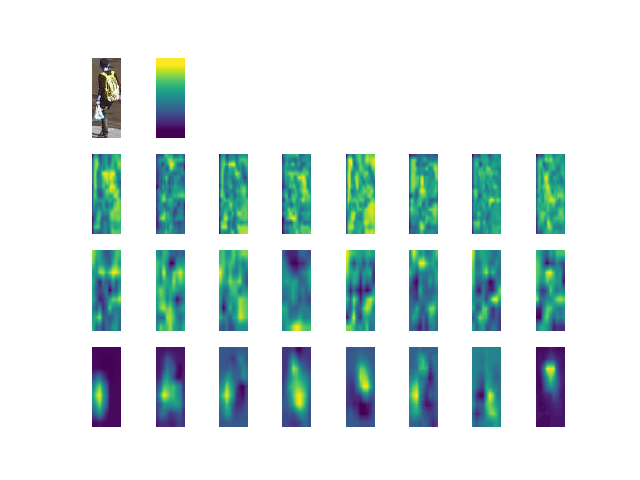

# HydraPlus Network
A re-implementation of [HydraPlus Net](https://arxiv.org/abs/1709.09930) based on Pytorch.  
With the help of [caffe implementtion](https://github.com/xh-liu/HydraPlus-Net) from original authors and another [pytorch version](https://github.com/CCC-123/Hydraplus_Net), 
the repository implements the network structure the same as the [caffe version](https://github.com/xh-liu/HydraPlus-Net/tree/master/prototxt_example). 

## Requirements  
pytorch  
CUDA 8.0  

## Dataset  
- PA-100K dataset  
- Download [link](https://drive.google.com/drive/folders/0B5_Ra3JsEOyOUlhKM0VPZ1ZWR2M)
- The directory structure looks like:
```shell script
.
├── README.md
├── att_vis.py
├── checkpoint
├── data
│   └── PA-100K
│       ├── annotation
│       └── release_data
│           └── release_data
├── lib
├── result
├── test.py
└── train.py
```


## Train
We train the network stagewisely, you can start with MNet (you need to define your GPU card ID and choose suitable batch size, learning rate and number of workers):
```shell script
CUDA_VISIBLE_DEVICES=$GPU_ID python train.py -m MNet -bs 128 -lr 0.01 -nw 16 -mGPUs
```
And then we train the attention branch with MNet weights:
```shell script
CUDA_VISIBLE_DEVICES=$GPU_ID python train.py -m AF1 -mpath checkpoint/MNet_epoch_995 -bs 128 -lr 0.1 -nw 16 -mGPUs
CUDA_VISIBLE_DEVICES=$GPU_ID python train.py -m AF2 -mpath checkpoint/MNet_epoch_995 -bs 128 -lr 0.1 -nw 16 -mGPUs
CUDA_VISIBLE_DEVICES=$GPU_ID python train.py -m AF3 -mpath checkpoint/MNet_epoch_995 -bs 128 -lr 0.1 -nw 16 -mGPUs
```
Finally, concatenate all the features from above four branches and train the last few layers of hydra-plus net:
```shell script
CUDA_VISIBLE_DEVICES=$GPU_ID python train.py -m HP -mpath checkpoint/MNet_epoch_995 \
                                                   -af1path checkpoint/AF1_epoch_190 \
                                                   -af2path checkpoint/AF2_epoch_170 \
                                                   -af3path checkpoint/AF3_epoch_175 \
                                                   -bs 512 -lr 0.01 -nw 32 -mGPUs
```

## Test
You can test each branch one by one:
```shell script
python test.py -m AF3 -p checkpoint/AF3_epoch_175
```
Or you can test the whole HydraPlus network:
```shell script
python test.py -m HP -p checkpoint/HP_epoch_175 -att pkl_save
```
With the arguments [-att](https://github.com/TianmingQiu/HydraPlusNet/blob/master/test.py#L39), you can choose to show the attention images or save them as pickle files.

## Results
|  |PA-100K|
| :---- | :----- |
| mA | 67.04% |
| ACC | 65.87% |
| Prec | 82.08% |
| Rec | 74.44% |
| F1 | 78.08% |

- Attention results:

 

- You can download the **pre-trained checkpoints** and **attention pickle files** from this [link](https://drive.google.com/drive/folders/10WcprvwgzDxQVoyXzyClhYm90zo-9Qgh?usp=sharing).

- With the pickle files, you can easily have a look at the attention map by:
    ```shell script
    python att_vis.py
    ```
    Of course, remember to modify the [file directory](https://github.com/TianmingQiu/HydraPlusNet/blob/master/att_vis.py#L63).
